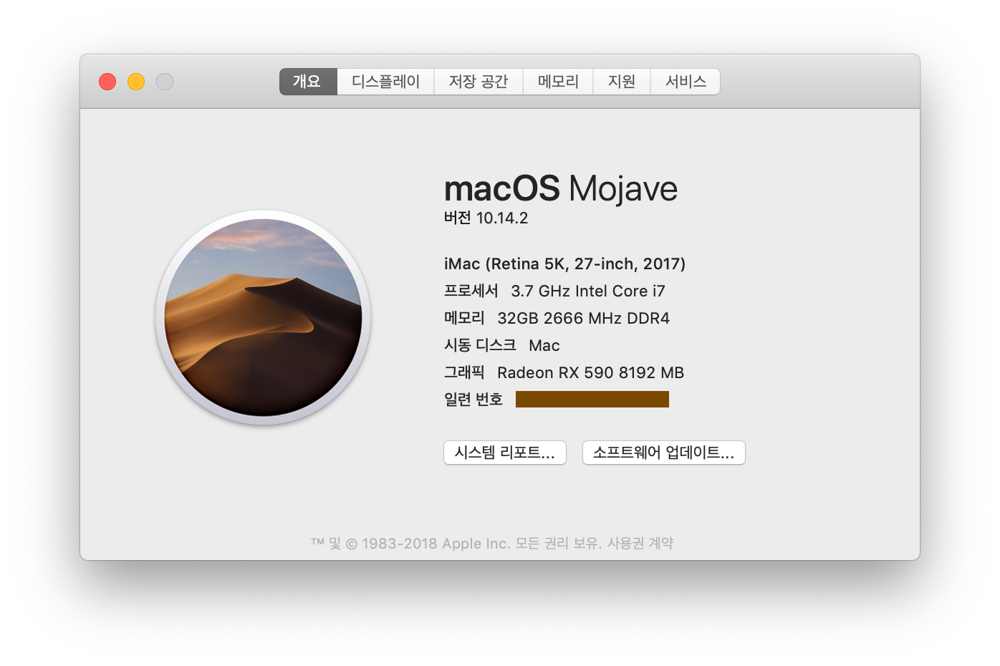

# hackintosh-config

My hakintosh trying referenced this repository. [gigabyte-z390-aorus-master-hackintosh](https://github.com/cmer/gigabyte-z390-aorus-master-hackintosh)

## Hardware

### Computer

* Intel i7-8700K 
* Gigabyte AORUS MASTER Z390
* Radeon RX590 NITRO Special Edition OC D5 8GB Dual-X
* Samsung 860 series EVO 1TB
* DELL UltraSharp U2718Q (midi-DP cable)
* Samsung DDR4 16GB PC4-21300 x2

### External device

* RME Babyface pro (works)
* Cheap bluetooth dongle (works)

## EFIs 

* ApfsDriverLoader-64.efi
* EmuVariableUefi-64.efi
* FSInject-64.efi              
* HFSPlus.efi
* OsxAptioFix2Drv-free2000.efi

## BIOS

..

## Test

### Works well

#### hardware

* Networking
* Ethernet
* On-board Audio
* RME USB Audio
* Preview application
* USB
* iLock3 USB
* APFS

#### softweare

* Logic pro X
* Finalcut pro 
* Pixelmator

### Not works

* On-board blutooth
* On-board Wifi (who cares?)

### Not tested

* IPhone related features (Im an Android user)